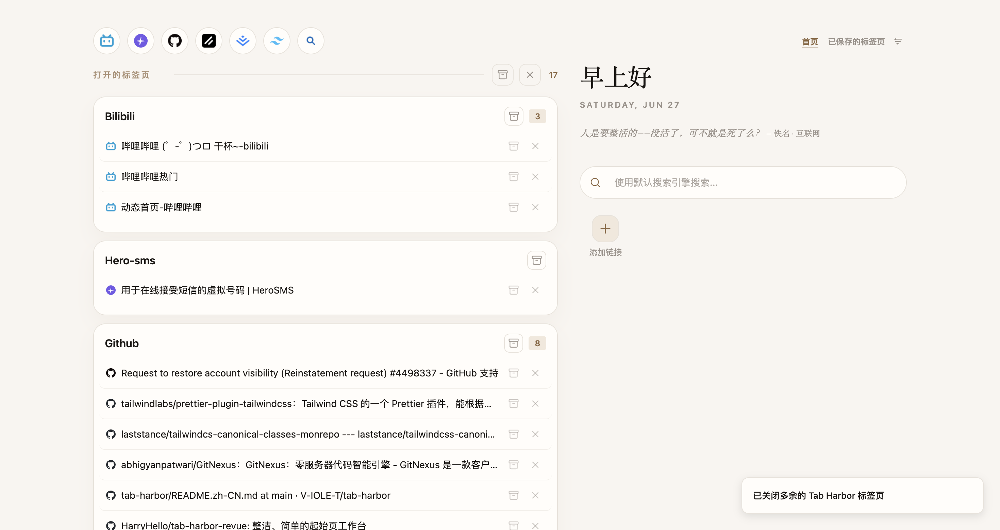

# Tab Harbor

<p>
  <a href="https://github.com/V-IOLE-T/tab-harbor"></a>
  <a href="https://www.typescriptlang.org/"></a>
  <a href="https://react.dev/"></a>
  <a href="https://wxt.dev"></a>
  <a href="https://tailwindcss.com/"></a>
</p>

> 基于 [tab-harbor](https://github.com/V-IOLE-T/tab-harbor) 完整重构的 Chrome 新标签页扩展，从纯 JavaScript 迁移到 WXT + React 19 + TypeScript + Tailwind CSS。

[**English**](./README.en.md)

---

## 📖 目录

- [简介](#-简介)
- [功能一览](#-功能一览)
- [截图](#-截图)
- [安装](#-安装)
- [技术栈](#-技术栈)
- [开发指南](#-开发指南)
- [项目结构](#-项目结构)
- [许可](#-许可)
- [致谢](#-致谢)

---

## 📖 简介

Tab Harbor 是一款 Chrome 新标签页扩展，帮助你管理浏览器中的标签页、书签和快捷方式，将混乱的浏览状态转化为有序可控的工作空间。

本仓库是对原始 [tab-harbor](https://github.com/V-IOLE-T/tab-harbor) 的**完整重构**：

- **技术栈升级**：纯 JavaScript → WXT + React 19 + TypeScript 5.9 + Tailwind CSS v4
- **架构重写**：全局作用域脚本 → 模块化 React 组件，Zustand 状态管理
- **UI 框架**：引入 shadcn/ui（radix-nova 风格）统一组件库
- **构建工具**：Vite + WXT 提供 HMR 开发体验
- **功能增强**：拖拽排序、书签栏、主题系统等新能力

设计语言和交互逻辑沿用了原版 Tab Harbor 的核心理念——**让浏览器更安静**。

---

## ✨ 功能一览

### 🗂 会话管理（Saved Sessions）

| 能力 | 说明 |
|------|------|
| 保存标签页 | 将当前打开的标签页保存为会话，支持选择和排除 |
| 拖拽排序 | 标签页内排序、跨会话拖动、拖到空白区域创建新会话 |
| 自动清理 | 空会话自动删除，保持列表整洁 |
| 折叠/展开 | 每个会话可折叠，减少视觉干扰 |
| 批量操作 | 一键恢复、删除会话 |

### 📑 书签栏（Bookmarks Bar）

| 能力 | 说明 |
|------|------|
| 显示 Chrome 书签 | 在标签页顶部展示 Chrome 书签栏文件夹内容 |
| 文件夹导航 | 多级文件夹可选展开，子菜单嵌套支持 |
| 溢出菜单 | 书签过多时自动显示 `>>` 溢出菜单 |
| 尺寸调节 | 支持紧凑/正常/大三种尺寸 |
| 开关控制 | 可在设置中启用/禁用 |

### 🔗 快捷方式（Quick Shortcuts）

| 能力 | 说明 |
|------|------|
| 自定义链接 | 自由添加和管理常用链接 |
| 图标缓存 | 使用 Chrome Favicon API 缓存图标 |
| 编辑面板 | 对话框式编辑，支持拖拽排序 |

### 🎨 主题系统

| 能力 | 说明 |
|------|------|
| 多套配色 | 多种预设主题色 |
| 深色/浅色 | 每套主题均有深色和浅色模式 |
| 透明度调节 | 自定义控件透明度 |
| 实时切换 | 切换无需刷新页面 |

---

## 🖼️ 截图



---

## 🔧 安装

### 手动加载

1. 克隆仓库：

   ```bash
   git clone https://github.com/V-IOLE-T/tab-harbor-react.git
   cd tab-harbor-react
   ```

2. 安装依赖：

   ```bash
   pnpm install
   ```

3. 构建：

   ```bash
   pnpm build
   ```

4. 打开 Chrome，访问 `chrome://extensions`
5. 开启**开发者模式**
6. 点击**加载已解压的扩展程序**
7. 选择项目根目录（或 `.output/chrome-mv3/` 目录）

### 从 Chrome 网上应用店

> 尚未发布

---

## 🛠 技术栈

| 层 | 技术 |
|------|--------|
| 框架 | [WXT](https://wxt.dev) + [React 19](https://react.dev) |
| 语言 | [TypeScript 5.9](https://www.typescriptlang.org) |
| 样式 | [Tailwind CSS v4](https://tailwindcss.com) + [shadcn/ui](https://ui.shadcn.com) (radix-nova) |
| 状态管理 | [Zustand v5](https://zustand.docs.pmnd.rs) |
| 图标 | [lucide-react](https://lucide.dev) |
| 拖拽 | [@hello-pangea/dnd](https://github.com/hello-pangea/dnd) |
| 国际化 | [i18next](https://www.i18next.com) + [react-i18next](https://react.i18next.com) |
| 构建 | [Vite](https://vitejs.dev) + [WXT](https://wxt.dev) |
| 包管理 | [pnpm](https://pnpm.io) |

---

## 🚀 开发指南

### 命令速查

| 用途 | 命令 | 说明 |
|------|------|------|
| 开发（Chrome） | `pnpm dev` | WXT HMR 开发服务器 |
| 开发（Firefox） | `pnpm dev:firefox` | |
| 构建（Chrome） | `pnpm build` | |
| 构建（Firefox） | `pnpm build:firefox` | |
| 类型检查 | `pnpm compile` | `tsc --noEmit` |
| 打包 zip | `pnpm zip` | 发布用 |
| 格式化 | `pnpm format` | Prettier 格式化 |


## 📁 项目结构

```
src/
├── background.ts           # Service Worker
├── content.ts              # Content Script
├── newtab/                 # 新标签页
│   ├── index.html
│   ├── main.tsx
│   ├── App.tsx
│   ├── components/         # 新标签页组件
│   │   ├── BookmarksBar.tsx
│   │   ├── SettingsDropdown.tsx
│   │   └── ...
│   ├── home/               # 首页
│   │   ├── HomePage.tsx
│   │   ├── DomainGroup.tsx
│   │   └── TabChip.tsx
│   └── saved-tabs/         # 会话管理
│       ├── SavedTabsPage.tsx
│       ├── SavedSessionCard.tsx
│       └── SavedSessionTabRow.tsx
├── popup/                  # 弹出面板
│   ├── index.html
│   └── main.tsx
├── components/             # 共享组件
│   ├── ui/                 # shadcn/ui 组件
│   └── settings/           # 设置面板
├── stores/                 # Zustand 状态
│   ├── savedSessions.ts
│   └── theme.tsx
├── styles/
│   └── globals.css         # Tailwind + CSS 变量
├── i18n/                   # 国际化
│   ├── en.ts
│   └── zh-CN.ts
└── lib/
    └── utils.ts            # 工具函数
```

---

## 📄 许可

本仓库基于原始 [tab-harbor](https://github.com/V-IOLE-T/tab-harbor)（MIT 许可）重构。

[Apache-2.0](https://github.com/V-IOLE-T/tab-harbor/blob/main/LICENSE)

---

## 🙏 致谢

- [tab-harbor](https://github.com/V-IOLE-T/tab-harbor) — 原始项目，本仓库的设计基础和灵感来源
- [Zara](https://github.com/zarazhangrui) — [tab-out](https://github.com/zarazhangrui/tab-out) 开源项目，Tab Harbor 的上游起点
- [WXT](https://wxt.dev) — 优秀的 Web 扩展开发框架
- [shadcn/ui](https://ui.shadcn.com) — 高质量的 UI 组件库
